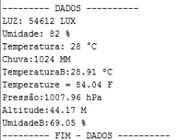
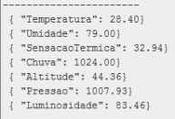
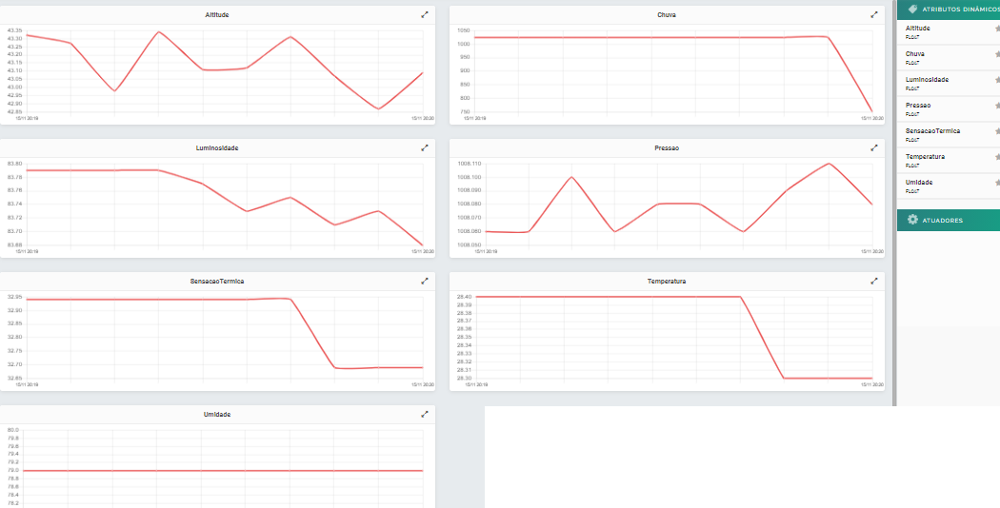

# Estacao-Metereologica-ESP8266

Projeto de uma estação metereologica com ESP8266 enviando dados para a plataforma DOJOT atraves do protocolo MQTT 
Projeto academico para a disciplina de IOT na faculade UCL 
Aluno:Cleison Mendes Paiva 
Curso:Sitemas de Informação 

Materiais Utilizads:
1 Placa ESP8266(Com modulo wifi integrado)  
1 Sensor de temperatura e umidade DHT11(DHT22 tambem funciona) 
1 Sensor de luminosidade BH1750 
1 Senso de Chuva(Com modulo)  
1 Sensor de Barometrico BME280 
2 Protoboard de 830 pontos 
Cabos jumpers 

Bibliotecas Utilizadas:
<ESP8266WiFi.h>  
<PubSubClient.h> 
<Wire.h> 
<ErriezBH1750.h>  
<Adafruit_Sensor.h> 
<Adafruit_BME280.h> 
"DHT.h" 

Instalando as bibliotecas e executando o codigo "Principal_v1" podemos obter no serial os valores de medição dos sensores conforme a imagem de exemplo abaixo.

Instalando as bibliotecas e executando o codigo "Principal_v2_dojot" podemos obter no serial os valores de medição dos sensores conforme a imagem de exemplo abaixo,esses valores estão sendo enviados para a plataforma DOJOT.

Dados sendo apresentados na plataforma DOJOT.

Fontes:
https://techtutorialsx.com/2017/04/09/esp8266-connecting-to-mqtt-broker/ 
https://dojotdocs.readthedocs.io/pt_BR/latest/

